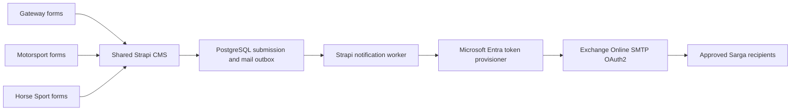

# 11 — GWR-CMS-MAIL-1 Exchange Online Email Assessment

Status: completed 2026-08-11. The approved transport foundation was subsequently
implemented in GWR-CMS-MAIL-2; see
`12_gwr_cms_mail_2_oauth_transport_spec.md`.

## Goal

Define a secure outbound-email architecture for all three Sarga websites and
the shared Strapi CMS using Microsoft Exchange Online and OAuth 2.0, without
adding another backend service or committing mailbox credentials.

## Assessment result

Strapi already includes an outbound Email feature. The project can use the
version-matched `@strapi/provider-email-nodemailer` provider, which supports
SMTP, STARTTLS, and OAuth2. A separate backend is not required.

The recommended production design is:

- keep Strapi as the only application backend and email orchestration point;
- install `@strapi/provider-email-nodemailer@5.49.0`, matching Strapi;
- connect to `smtp.office365.com:587` with `secure: false`, `requireTLS: true`,
  and TLS 1.2 or newer;
- authenticate with an app-only Microsoft Entra OAuth token and SMTP XOAUTH2;
- add a small repository-owned token provisioner inside Strapi so expiring
  access tokens are refreshed automatically;
- authorize the application only for the approved sender mailbox through
  Exchange Online RBAC for Applications;
- keep form submissions in PostgreSQL as the source of truth and deliver email
  notifications asynchronously with retry/audit state.

This is a small Strapi extension around supported primitives, not a second CMS
or standalone mail backend.

## Supplied configuration review

| Item | Assessment |
| --- | --- |
| SMTP `smtp.office365.com:587` | Correct for Exchange Online client submission. |
| SMTP encryption | STARTTLS is correct. Nodemailer must use `secure: false` plus `requireTLS: true`; `secure: true` is for implicit TLS, normally port 465. |
| OAuth 2.0 | Required for production. Use XOAUTH2 with short-lived access tokens. |
| Username/password fallback | Rejected as the long-term design. A time-boxed existing-tenant launch contingency was later approved in MAIL-4.1 after Microsoft's January 2026 SMTP AUTH timeline update; OAuth remains the target. |
| POP `outlook.office365.com:995` | Not needed for website/CMS outbound mail. Microsoft documents port 995 as implicit SSL/TLS, not STARTTLS, so the supplied incoming encryption label should be corrected if an email client will use it. |
| Sender `noreply@sargamotorsport.co` | Suitable for Motorsport transactional mail after tenant authorization. Sarga must approve sender identities for Gateway and Horse Sport before cross-brand production email is enabled. |

Strapi's built-in email feature is outbound-only. If Sarga later requires
incoming-message processing, replies, bounce ingestion, or mailbox automation,
that is a separate scope. Prefer Microsoft Graph subscriptions/webhooks over a
long-running POP poller.

## Target architecture



### Authentication flow

1. The Ubuntu CMS obtains an app-only access token from the tenant-specific
   Microsoft Entra token endpoint using a confidential application credential.
2. The requested scope is `https://outlook.office365.com/.default`.
3. Nodemailer authenticates the sender as `noreply@sargamotorsport.co` with
   SASL XOAUTH2 and the short-lived access token.
4. The token provisioner caches the token only in memory until shortly before
   expiry and requests a replacement automatically.
5. Secrets remain in `/etc/sarga/cms.env` or an approved secret manager; token,
   client secret, and mailbox password values are never logged or committed.

For the current single Ubuntu VM, a client secret in a root-owned systemd
environment file is the lowest-effort supported credential. A certificate is
preferred when Sarga IT can operate certificate issuance and rotation.

## Microsoft 365 administrator prerequisites

Sarga's Microsoft 365/Exchange administrator must complete and verify these
items before implementation UAT:

1. Confirm that `noreply@sargamotorsport.co` is a licensed mailbox or supported
   sender identity and that SMTP AUTH is enabled only for that mailbox if the
   tenant disables it globally.
2. Create a dedicated Microsoft Entra application for Sarga CMS mail. Do not
   reuse a developer or unrelated production application.
3. Create the Exchange Online service principal for that application.
4. Use Exchange Online RBAC for Applications to grant only `Application
   SMTP.SendAsApp` over a resource scope containing the approved sender
   mailbox. Avoid tenant-wide mailbox access.
5. Provide the Tenant ID, Client ID, and an approved client credential through
   the secret handover channel. Do not send credentials in Git, tickets, or
   chat history.
6. Confirm the outbound VM can reach `login.microsoftonline.com:443` and
   `smtp.office365.com:587`.
7. Confirm SPF, DKIM, and DMARC are enabled and aligned for each approved From
   domain.

If Sarga IT cannot authorize SMTP app-only access, the preferred alternative is
Microsoft Graph `Mail.Send` with application RBAC. For the urgent 2026-08-14
launch only, MAIL-4.1 documents a guarded existing-tenant Basic SMTP fallback
with explicit acknowledgement and mandatory expiry. It must not become the
long-term application credential.

## Proposed runtime configuration contract

The following transport names were implemented in GWR-CMS-MAIL-2. Recipient
variables remain reserved for GWR-CMS-MAIL-3 and are not active yet:

```dotenv
MAIL_ENABLED=false
MAIL_PROVIDER=microsoft-oauth-smtp
MAIL_SMTP_HOST=smtp.office365.com
MAIL_SMTP_PORT=587
MAIL_SMTP_REQUIRE_TLS=true
MAIL_SMTP_USER=noreply@sargamotorsport.co
MAIL_FROM_ADDRESS=noreply@sargamotorsport.co
MAIL_FROM_NAME=Sarga Motorsport
MAIL_DEFAULT_REPLY_TO=noreply@sargamotorsport.co
MICROSOFT_TENANT_ID=<tenant-guid>
MICROSOFT_CLIENT_ID=<application-guid>
MICROSOFT_CLIENT_SECRET=<secret-store-value>
MICROSOFT_SMTP_SCOPE=https://outlook.office365.com/.default
MAIL_RECIPIENT_GATEWAY=<approved-internal-recipient>
MAIL_RECIPIENT_MOTORSPORT=<approved-internal-recipient>
MAIL_RECIPIENT_HORSESPORT=<approved-internal-recipient>
```

The client secret must never have a local default. Staging and production use
separate application credentials or separately scoped credentials. Local
development uses a local SMTP capture service or leaves `MAIL_ENABLED=false`;
it must not send through the production mailbox.

## Transactional email scope

The Exchange Online connection is intended for low-volume transactional mail:

- internal notification when a contact or rider inquiry is stored;
- optional visitor receipt after legal/copy approval;
- Strapi administrator invitation/password-reset messages;
- operational test messages available only to Super Admin.

It is not the bulk newsletter delivery engine. Newsletter subscriptions remain
stored in Strapi, but campaigns require a separately approved marketing-email
service with unsubscribe, consent, suppression, and analytics controls.

For inquiry notifications:

- `From` is a server-controlled approved Sarga mailbox;
- `Reply-To` may be the validated visitor address;
- recipients come only from server environment allowlists, never request data;
- the form response succeeds after durable database storage, not after SMTP;
- delivery failures are recorded and retried without duplicating the inquiry.

## Delivery phases

### GWR-CMS-MAIL-1 — Assessment and architecture

Status: complete.

- Audit the current sendmail-only CMS state and form submission paths.
- Confirm Strapi/Nodemailer and Microsoft OAuth feasibility.
- Define security, tenant prerequisites, environment contract, and boundaries.

### GWR-CMS-MAIL-2 — OAuth transport foundation

Status: complete 2026-08-11. Credentialed staging verification remains pending
Microsoft 365 administrator provisioning.

- Install the version-matched Nodemailer provider.
- Add the Entra token provisioner with in-memory expiry-aware caching.
- Configure STARTTLS/TLS 1.2+, From/Reply-To defaults, redacted logging, and a
  disabled-by-default local environment.
- Add token/transport unit tests and a non-delivery connection verification.
- Update Docker, systemd/VM, environment, secret-rotation, and rollback docs.
- Stop for approval after connectivity evidence; do not wire public forms yet.

### GWR-CMS-MAIL-3 — Transactional notification workflow

Estimate: 2–4 engineering days, depending on approved templates and recipients.

- Add durable pending/sent/failed delivery state and bounded retry behavior.
- Route Gateway, Motorsport, and Horse Sport inquiries to approved recipients.
- Add bilingual templates and optional visitor receipts only after copy/privacy
  approval.
- Keep newsletter campaigns out of Exchange Online transactional delivery.
- Add idempotency, header-injection, recipient-allowlist, and failure tests.

### GWR-CMS-MAIL-4 — Staging UAT and handover

Estimate: 1–2 engineering days plus Sarga IT validation.

- Run staged token renewal, SMTP send, retry, and fail-closed tests.
- Verify SPF/DKIM/DMARC alignment, sender reputation, and Outlook delivery.
- Validate secret rotation and expired/revoked credential behavior.
- Update operator runbooks, monitoring, backup implications, and launch gates.

Total estimated engineering effort is 4.5–8.5 days. The critical external
dependency is Microsoft 365 tenant administration, not Strapi development.

## Acceptance gates

- No mailbox password or OAuth token is committed, returned to a browser, or
  written to application logs.
- OAuth is the target production configuration. If MAIL-4.1 is invoked, Basic
  authentication is explicit, time-boxed, protected at runtime, and removed at
  OAuth cutover.
- The application can send only as explicitly scoped mailbox identities.
- SMTP refuses downgrade when STARTTLS/TLS 1.2+ is unavailable.
- A stored inquiry survives mail-provider outage and is retried safely.
- A client cannot choose From, SMTP recipient, template path, or mail headers.
- Staging proves token renewal, revocation behavior, and deliverability before
  production enablement.

## Decisions required before GWR-CMS-MAIL-2

- Sarga Microsoft 365 tenant ID and who owns Entra/Exchange setup.
- Client secret versus certificate credential for the first deployment.
- Approved sender address for Gateway and Horse Sport, or explicit approval to
  use the Motorsport sender across all three brands.
- Internal recipient list per site and whether visitor receipts are required.
- Whether SMTP app-only access is approved; otherwise use Microsoft Graph
  `Mail.Send` as the alternative transport.

## Primary references

- [Strapi Email feature](https://docs.strapi.io/cms/features/email)
- [Strapi advanced Nodemailer configuration](https://docs.strapi.io/cms/configurations/email-nodemailer)
- [Microsoft OAuth for IMAP, POP, and SMTP](https://learn.microsoft.com/en-us/exchange/client-developer/legacy-protocols/how-to-authenticate-an-imap-pop-smtp-application-by-using-oauth)
- [Microsoft SMTP App RBAC onboarding](https://learn.microsoft.com/en-us/exchange/client-developer/legacy-protocols/smtp-app-rbac-onboarding)
- [Microsoft SMTP AUTH mailbox configuration](https://learn.microsoft.com/en-us/exchange/clients-and-mobile-in-exchange-online/authenticated-client-smtp-submission)
- [Microsoft Exchange Online Basic authentication deprecation](https://learn.microsoft.com/en-us/exchange/clients-and-mobile-in-exchange-online/deprecation-of-basic-authentication-exchange-online)
- [Microsoft POP/SMTP endpoint and encryption settings](https://learn.microsoft.com/en-us/exchange/clients-and-mobile-in-exchange-online/pop3-and-imap4/pop3-and-imap4)
